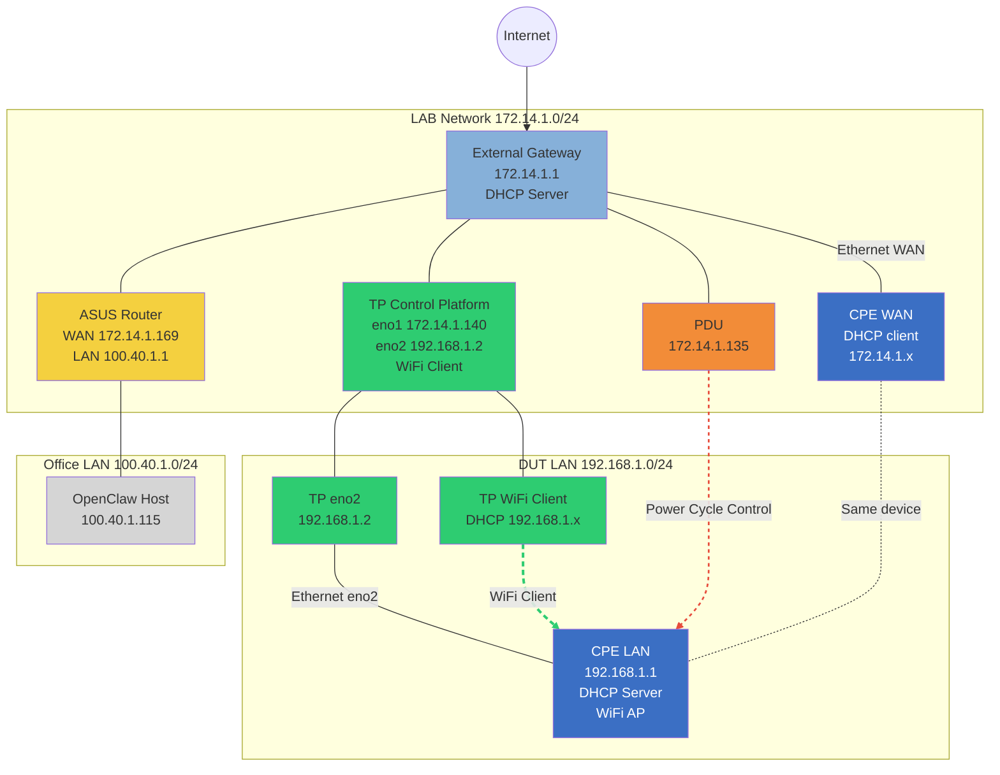

# Charter Test Platform Physical Topology

本頁解讀目前 Charter 測試平台的實體拓撲（physical topology），並標註各網段用途與資料流向。

## 快速導覽

**一句話結論**：此拓撲描述 Charter 測試平台三個網段（LAB / DUT LAN / Office）與 TP、CPE、PDU 的連線關係。

### 必接 / 可選（先確認線有沒有插對）

- **必接（能跑大多數 sanity/stability）**
  - TP eno2 ↔ CPE LAN（`192.168.1.0/24`）
  - TP ↔ CPE console（serial；`CPE_DEV=/dev/serial/by-id/*`）
  - TP ↔ PDU（需要 power-cycle 類 stability 時）
- **可選（只跑特定 case 才需要）**
  - TP Wi‑Fi client（WLAN / SSID 類）
  - macvlan（需要多個 MAC / 多 client DHCP）
  - global IPv6（若環境沒有 global IPv6，可把相關 case 視為 skip，不算平台移植失敗）

### 典型資料流（腳本常做的 5 件事）

- 對外：TP eno1（LAB `172.14`）→ GW → Internet/NOC
- 控 DUT：TP eno2（DUT LAN `192.168`）→ CPE LAN（`192.168.1.1:22`）
- 模擬 LAN client：`lan_macvlan.py` 掛在 `LAN_PARENT_IFACE`
- Wi‑Fi 測：TP Wi‑Fi client → CPE SSID → DHCP `192.168.1.x`
- Power cycle：TP/tools → PDU（`172.14.1.135`）→ Power Cycle Control → CPE

---

## 拓撲圖

### Lab Physical Topology（Mermaid，可維護）

---

## 1) 網段與角色

### A. LAB 管理網段：`172.14.1.0/24`
- **External Gateway / Router**
  - WAN：`61.216.9.52`（Public）
  - LAN：`172.14.1.1/24`（DHCP Server）
  - 作用：LAB 的對外出口與 DHCP
- **TP（Charter 測試平台 / control PC） eno1**
  - IP：`172.14.1.140/24`
  - default GW：`172.14.1.1`
  - 作用：平台主機對外連線（NOC、Internet）
- **CPE WAN（同一台盒子 / DUT 的 WAN 端）**
  - DHCP client（從 172.14.1.0/24 取得）
  - 例：`172.14.1.199/24`
- **PDU（控制 CPE 電源）**
  - IP：`172.14.1.135/24`
  - 作用：power control（供 stability power-cycle 類腳本使用）
- **ASUS Router（WAN）**
  - IP：`172.14.1.169/24`
  - GW：`172.14.1.1`
  - 作用：提供另一個內部 NAT LAN（100.40.1.0/24）

### B. 內部 NAT LAN：`100.40.1.0/24`
- **ASUS LAN GW**：`100.40.1.1/24`（NAT/Router）
- **OpenClaw Host**：`100.40.1.115/24`
  - 作用：你現在開文件站（mkdocs）給其他人 review

> 註：此段網段主要是「辦公/管理使用」，與 DUT 的 CPE LAN（192.168.1.0/24）是不同域。

### C. DUT LAN：`192.168.1.0/24`（CPE LAN）
- **CPE LAN**
  - GW / DHCP：`192.168.1.1/24`
  - 作用：DUT 提供給 LAN client / Wi‑Fi client 的內網
- **TP eno2（有線連到 CPE LAN）**
  - IP：`192.168.1.2/24`（固定）
  - 介面命名提醒：文件用 `eno2` 代表「CPE LAN 那張網卡」；不同機器可能顯示為 `enx...`（USB NIC）或 `enp...`（PCIe NIC），請以實機為準。
  - 作用：
    - 作為 scripts 的 `LAN_PARENT_IFACE`（macvlan 模擬 LAN client）
    - 對 CPE 做 LAN 側 SSH（常見：`192.168.1.1:22`）
- **TP Wi‑Fi NIC（無線網卡）**
  - DHCP client
  - SSID：`SpectrumSetup-6A4D`
  - 作用：Wi‑Fi sanity/stability（wifi_iwd/wifi_nm）

---

## 2) 典型資料流（scripts 常做的事）

> 目的：把「腳本在做什麼」直接對應到拓撲中的線路與網段。看不懂時，先對照這 5 條。

### (1) 平台對外連線（NOC / Internet）
- 走哪條線：**TP eno1（LAB 172.14） → GW（172.14.1.1） → Internet / NOC**
- 常見用途：NOC API、下載/上傳、外部連線檢查

### (2) 控制 DUT（LAN / SSH）
- 走哪條線：**TP eno2（DUT LAN 192.168） → CPE LAN（192.168.1.1:22）**
- 常見用途：LAN 端 SSH、抓 CPE 狀態、跑 tools（cpe_info / cpe_ssh 等）

### (3) 模擬 LAN client（macvlan）
- 走哪條線：仍在 **TP eno2（DUT LAN）** 上做 L2/L3 模擬（不會走到 LAB）
- 作法：`lan_macvlan.py` 掛在 `LAN_PARENT_IFACE`（此環境等同 TP eno2）
- 目的：用「不同 MAC」取得 DHCP lease / 模擬多個 LAN client

### (4) Wi‑Fi client 測試（WLAN / SSID）
- 走哪條線：**TP Wi‑Fi NIC → 連到 CPE SSID（Wi‑Fi AP） → DHCP 192.168.1.x**
- 常見用途：WLAN client connect、SSID broadcast/toggle、Wi‑Fi longrun
- 常見檢查：ping router（192.168.1.1）/（選配）ping internet

### (5) Power cycle control（stability）
- 走哪條線：**TP（tools） → PDU（172.14.1.135） → Power Cycle Control → CPE**
- 常見用途：reboot/power-cycle 類 stability case、遇到 DUT 卡死的外部復原

## 3) 交付外部單位時要特別標註/替換
- 三個網段可能完全不同：`172.14.1.0/24`、`192.168.1.0/24`、`100.40.1.0/24`
- `LAN_PARENT_IFACE` / `WIFI_IFACE` / `PING_IFACE` 依對方 control PC 實際網卡決定
- PDU 若不存在：stability 中 power-cycle 類 case 需禁跑或改實作

> 搭配閱讀：Hand-off → 網卡判定指南 / NOC Profile & Secrets。
