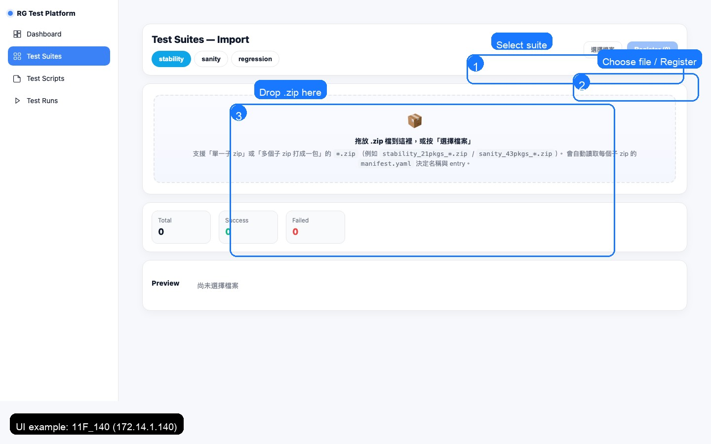

# Scripts 管理（匯入 / 匯出 / 修改 / 刪除）

本頁是「腳本管理」SOP：讓同事用最短路徑完成 **匯入/匯出/修改/刪除/避免 DUPLICATE**。

> 原則（DA40 偏好）：**API 優先**，UI 只用來觀察/輔助操作。

---

## 快速摘要（最常用 3 件事）

> 想看一條龍流程：請直接看 [腳本修改 SOP（入口）](script_change_sop.md)

1) **匯入前：同名先刪再匯入**（避免 `skipped:DUPLICATE`）
2) **修改前：先 Export 備份**
3) **出問題先看 Runs log，再看 worker log**（`journalctl -u charter-worker.service ...`）

---

## 1) API 操作（推薦）

> 適合：批次處理、寫自動化、避免 UI 誤點。

### 1.1 匯入（Import）
- Endpoint：`POST /api/scripts/import2`
- 重點規則：**同名（suite+name）先刪再匯入**

### 1.2 匯出（Export）
- Endpoint：`GET /api/scripts/{script_id}/export`

### 1.3 刪除（Delete）
- Endpoint：`DELETE /api/scripts/{script_id}`

---

## 2) 腳本 zip 結構（你在改什麼？）

一個 script zip 常見包含：
- `manifest.yaml`
- `requirements.txt`
- `main.py` / `main_impl.py`
- entrypoint（常見）：`cycle_wrapper.py:run`

> 換環境需要改哪些參數：請看 [Environment Template](../environment_template.md)

---

## 3) UI 操作（給第一次接觸平台的同事）

> 提示：以下截圖可點擊放大。

### 3.1 匯入腳本（Test Suites → Import）

- 建議流程：選 suite → 拖放 zip → Register → 確認 Success/Failed 計數



**最常見踩坑**：同名（suite + name）請先刪再匯入，否則可能出現 `skipped:DUPLICATE`。

### 3.2 Scripts 列表（篩選 / 單支操作 / 批次操作）

- 上方可用 suite filter + 搜尋（依 script name）
- 每支腳本右側提供：Run / Export / Modify / Delete


### 3.3 匯出腳本（Export）

- UI 入口：Test Scripts → 目標 script → Export
- API 方式（推薦用於自動化/批次）：`GET /api/scripts/{script_id}/export`

### 3.4 修改腳本（Modify）

**標準流程（建議照做）**：
1) Export 備份
2) 修改 zip（manifest/code）
3) 刪同名（suite+name）
4) Import
5) Run 驗證

> 重要：平台固定參數以 systemd / `.secrets` 為準；`manifest.yaml` 只提供 defaults。

---

## 4) 常見問題（FAQ）

### Q1：為什麼 Import 後顯示 skipped:DUPLICATE？
A：同名（suite+name）已存在。請先 Delete 舊的，再 Import。

### Q2：修改後跑起來怪怪的，怎麼排查？
A：
1) 先看 Runs log（UI 或 API 取 `/api/runs/{id}/log`）
2) 再看 worker log：
```bash
sudo journalctl -u charter-worker.service -n 200 --no-pager
```

### Q3：換環境後哪裡要改？
A：請看 [Environment Template](../environment_template.md)（哪個參數放 systemd / `.secrets` / manifest）。
