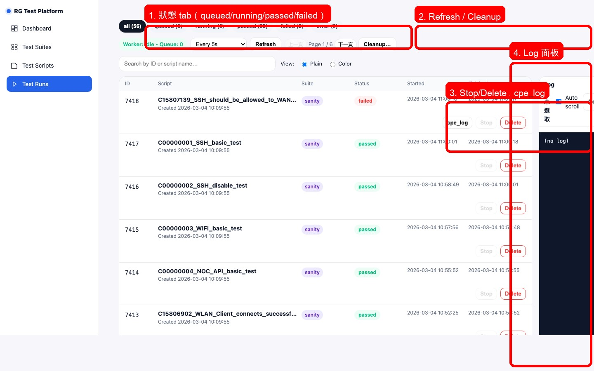
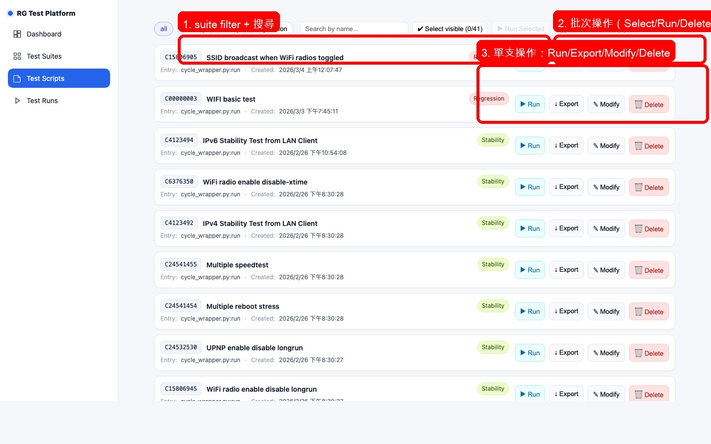
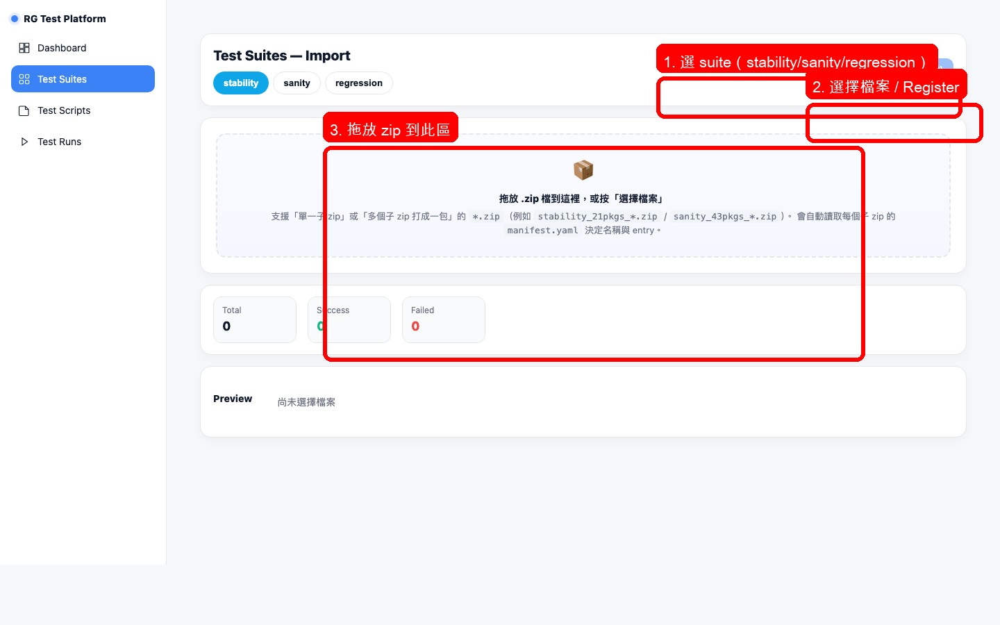

# 常用維運（被移轉者專用）

> 目標：讓被移轉者也能自己處理日常維運工作。

---

## 🎯 我是誰？

| 問題 | 答案 |
|------|------|
| 這是什麼？ | 日常維運操作手冊 |
| 誰要看？ | 被移轉的工程師 |
| 怎麼用？ | 照著複製指令 |

---

## ⏱️ 每天要做的事

| 工作 | 指令 | 多久一次 |
|------|------|----------|
| 檢查 Worker 狀態 | `curl http://172.14.1.140:5173/api/runs/worker/status` | 每天開工 |
| 清理舊資料 | `curl -X DELETE "http://172.14.1.140:5173/api/runs/purge?older_than_days=7"` | 視情況 |

---

## GUI 操作（圖形介面）

### 位置
- **網址**：http://172.14.1.140:5173

### Runs 頁面



| 功能 | 說明 |
|------|------|
| Runs 列表 | 顯示所有執行的測試 |
| Status | PASS / FAIL / RUNNING |
| 看 Log | 點擊某一筆查看詳細 |

### Scripts 頁面



| 功能 | 說明 |
|------|------|
| Scripts 列表 | 顯示所有腳本 |
| 執行 | 點擊 Run 按鈕 |
| Export | 匯出腳本備份 |

### Suites 頁面



| 功能 | 說明 |
|------|------|
| Sanity | 一般測試 |
| Stability | 長期穩定性測試 |

---

## Step 1：檢查 Worker 狀態

### 指令
```bash
curl -sS "http://172.14.1.140:5173/api/runs/worker/status" | jq .
```

### 可能結果

| 狀態 | 意思 |
|------|------|
| `idle` | 正常，沒在跑 |
| `running` | 有工作在跑 |

### 如果卡住
```bash
# 重啟 worker
ssh da40@172.14.1.140 "sudo systemctl restart charter-worker"
```

---

## Step 2：清理舊 Runs

### 指令
```bash
# 清理全部已完成
curl -sS -X DELETE "http://172.14.1.140:5173/api/runs/purge?older_than_days=0" | jq .

# 清理 7 天前
curl -sS -X DELETE "http://172.14.1.140:5173/api/runs/purge?older_than_days=7" | jq .
```

### GUI 清理方式

在 Runs 頁面，手動刪除不需要的記錄。

---

## 📁 資料位置

### Control PC 上

| 資料 | 路徑 |
|------|------|
| Workdir | `/home/da40/charter/data/work/run_<id>/` |
| Venv | `/home/da40/charter/data/venv/script_<script_id>/` |
| 腳本備份 | `/home/da40/charter/data/scripts/` |
| Logs | `/home/da40/charter/data/logs/` |

---

## ⚠️ 變更前規範

### 一定要做！

| 動作 | 怎麼做 |
|------|--------|
| 改腳本前 | 先 Export 備份 |
| 匯入前 | 先刪除同名腳本（避免 DUPLICATE）|
| 改系統前 | 備份相關檔案 |

### Export 指令
```bash
curl -sS "http://172.14.1.140:5173/api/scripts/5225/export" -o backup.zip
```

### Delete 指令
```bash
curl -sS -X DELETE "http://172.14.1.140:5173/api/scripts/5225" | jq .
```

---

## ❓ 遇到問題？

| 問題 | 處理 |
|------|------|
| Worker 沒反應 | 重啟：`systemctl restart charter-worker` |
| 空間不足 | 先跑 purge 清理舊 runs |
| 不知道 Script ID | 查詢：`/api/scripts?suite=sanity&q=關鍵字` |

---

## 📞 支援

- 文件站：http://172.14.1.140:8000/
- 相關頁面：/runbook/troubleshooting/, /user_guide/runs/
