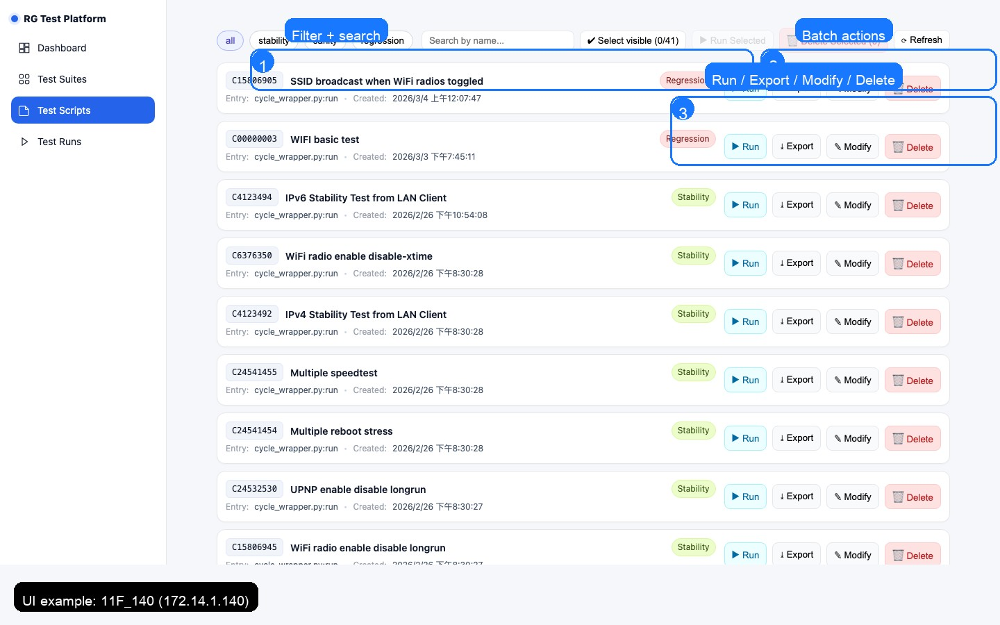
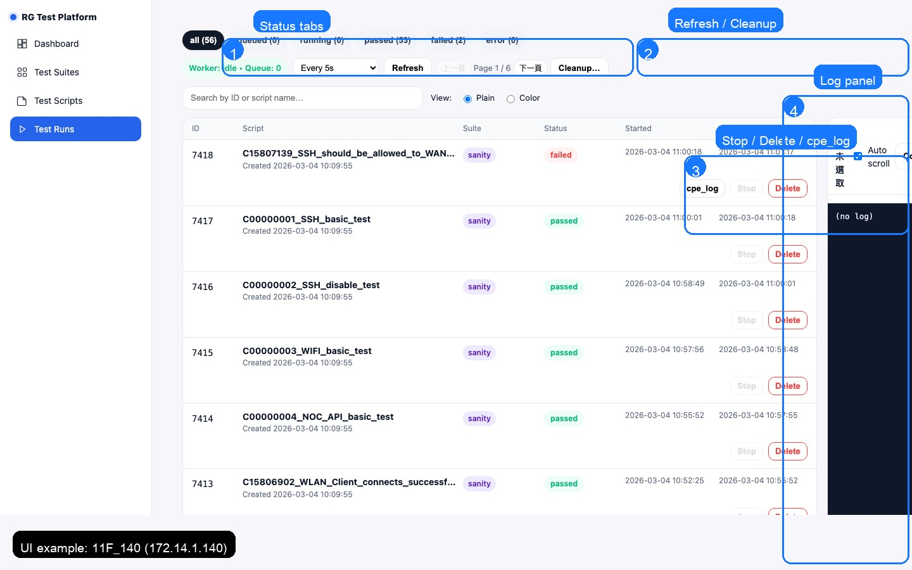

# Scripts 管理

> 原則（DA40 偏好）：**API 優先**，Selenium 只做 UI 呈現/互動驗證。

## 匯入（Import）
- 建議路徑：`POST /api/scripts/import2`
- 規則：**同名（suite+name）先刪再匯入**，避免 `skipped:DUPLICATE`

## 匯出（Export）
- `GET /api/scripts/{script_id}/export`

## 刪除（Delete）
- `DELETE /api/scripts/{script_id}`

## 腳本 zip 格式（概要）
- `manifest.yaml`
- `requirements.txt`
- `main.py` / `main_impl.py`
- entrypoint（常見）：`cycle_wrapper.py:run`

> 外部單位替換項目請見：Environment Template。

---

## UI 操作（含截圖）

> 提示：以下截圖 **可點擊放大**（建議用於確認按鈕位置與狀態）。

> 目的：讓第一次接觸平台的人，能在 UI 上快速完成「匯入 / 匯出 / 執行 / 修改」並知道常見踩坑點。

### 1) 匯入腳本（Test Suites → Import）

- 建議流程：選 suite → 拖放 zip → Register → 確認 Success/Failed 計數

**注意（最常見踩坑）**：同名（suite + name）請先刪再匯入，否則可能出現 `skipped:DUPLICATE`。

### 2) Scripts 列表（篩選 / 單支操作 / 批次操作）

- 上方可用 suite filter + 搜尋（依 script name）
- 每支腳本右側提供：Run / Export / Modify / Delete

### 3) 匯出腳本（Export）

- UI 入口：Test Scripts → 目標 script → Export
- API 方式（推薦用於自動化/批次）：`GET /api/scripts/{script_id}/export`

### 4) 修改腳本（Modify）

- 建議流程：先 Export 備份 → 修改 zip（manifest/code）→ 刪同名 → Import → Run 驗證
- 原則：平台參數以 systemd env 為準；`manifest.yaml` 只提供 defaults

### 5) Runs（觀察 queue / log / stop / delete）

- 常用：Refresh / Cleanup
- 失敗分析：點進 log 先定位 fail step/event，再做 root cause 分類與修正（見 Runbook/Capabilities）

